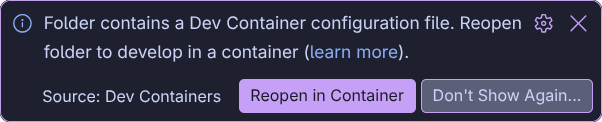
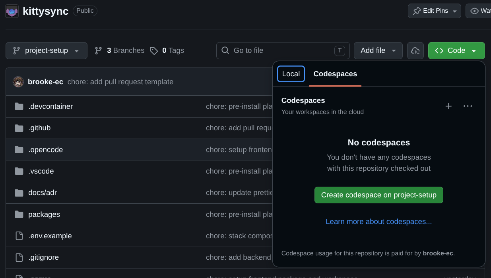

# KittySync

Coursework for our Advanced Software Engineering module.

# Local Execution

Coming soon (see [#13](https://github.com/kitty-committee/kittysync/issues/13))

# Development

This repository consists of three packages located in the `packages` directory. [`frontend`](https://github.com/kitty-committee/kittysync/tree/main/packages/frontend) is a [Svelte Kit](https://svelte.dev/docs/kit/introduction) project acting as KittySync's frontend. [`backend`](https://github.com/kitty-committee/kittysync/tree/main/packages/backend) is a [Fastify](https://fastify.dev/)-based backend for the KittySync project. And [`common`](https://github.com/kitty-committee/kittysync/tree/main/packages/backend) is a shared package for common functionality and structures.

This repository uses the [pnpm](https://pnpm.io/) package manager. You can scope [pnpm](https://pnpm.io/) commands to an individual package using `pnpm frontend <command>`, `pnpm common <command>` or `pnpm backend <command>`. This will be useful for installing new dependencies, which will **otherwise be installed to the workspace** and not work.

If you are using [Visual Studio Code](https://code.visualstudio.com/), we suggest install the workspace's recommended extensions. You will be given the option to do this by a popup when you first open the folder. Installing these extensions will greately improve your developer experience.

There is no strict rules for commit messages, however we encourage using [Conventional Commits](https://www.conventionalcommits.org/en/v1.0.0/). However, commit messages must always be meaningful and avoid offensive language.

### Running the development server

To see your code changes in action, you can use the `pnpm dev` command, which will the app accessible at http://127.0.0.1:5173/. While the development server is running, any code changes you make will trigger an automatic reload. You can also start a single package's dev server using `pnpm frontend dev` or `pnpm backend dev`.

### Testing and linting

There are three different types of tests you can run against the repository. `pnpm test` will run all unit tests defined in the repository using [vitest](https://vitest.dev/). `pnpm lint` will check the project for common logic, style and formatting errors using [ESLint](https://vitest.dev/) and [Prettier](https://prettier.io/). `pnpm check` will run static type checking using the [TypeScript](https://www.typescriptlang.org/) compiler.

> [!TIP]
> All three of these tests must pass before you can merge a pull request. It is a good idea to run `pnpm format` before pushing changes, which will update your code to conform to our code style conventions.

### Installation

There are three ways to set up a development environment for KittySync, two of which require Docker to be installed on your machine. Pick one of the options below to start coding!

## Option 1 - manual setup (most versitile)

1. Install Docker on your local machine. The easiest way to do this for most users is to install [Docker Desktop](https://docs.docker.com/desktop/).

2. Install **NodeJS v24.21.0** with [pnpm](https://pnpm.io/installation) using your preferred method: [volta](https://volta.sh/) (recommended), OS package manager, or [prebuilt binary](https://nodejs.org/en/download).

3. Clone the repository (e.g. [GitHub Desktop](https://desktop.github.com/download/) or `git clone https://github.com/kitty-committee/kittysync`).

4. Navigate to the workspace root and install dependencies with `pnpm install`.

5. Run `pnpm frontend playwright install` to download headless browsers for Playwright testing.

6. Use `pnpm stack:start` to start local instances of PostgreSQL and Redis (you can use `pnpm stack:stop` to stop them when you have finished developing).

7. Copy `.env.example` to `.env` for local secrets and configuration values (default values designed for manual setup).

## Option 2 - local devcontainer (easier)

1. Install Docker on your local machine. The easiest way to do this for most users is to install [Docker Desktop](https://docs.docker.com/desktop/).

2. Install [Visual Studio Code](https://code.visualstudio.com/) on your local machine.

3. Clone the repository (e.g. [GitHub Desktop](https://desktop.github.com/download/) or `git clone https://github.com/kitty-committee/kittysync`).

4. Open the workspace with Visual Studio Code and install the [Dev Containers Extension](https://marketplace.visualstudio.com/items?itemName=ms-vscode-remote.remote-containers). This will allow you to reopen the workspace in a container which, after some waiting, will give you a preconfigured development environment.

    

## Option 3 - remote devcontainer (minimal installation)

This option involves connecting to a devcontainer running on a remote machine. As a result it requires zero local setup, making it ideal for running on the lab machines.

### Using Kitty Committee's Coder instance

We are hosting our own [instance of Coder](https://coder.kittycommittee.xyz/), a self-hostable remote development environment solution. If you are a member of the Kitty Committee organisation, you can login and spin up workspaces whenever you like. Keep in mind though, that this server has limited resources and even more limited bandwidth. If you have any issues with this, try one of the other solutions listed above.

### Using GitHub Codespaces

[GitHub Codespaces](https://github.com/features/codespaces) is a cloud development environment solution, with a free tier offering **15GB** of storage and **120 hours** of compute time per month. This can be upgraded to 20GB and 180 hours of compute if you join [GitHub Education](https://github.com/education) but further usage requires billing to be set up on your account. If you would prefer to avoid this, you can use our Coder instance above.

You can get started with GitHub Codespaces directly from the GitHub repository page:

    

